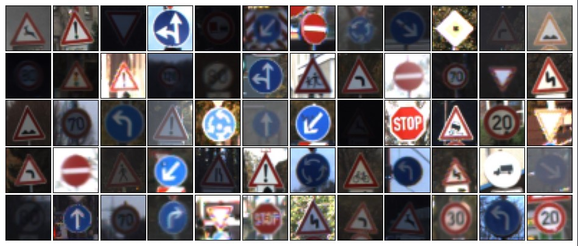

# Traffic Sign Classifier

This project implements a Traffic Sign Classifier using Convolutional Neural Networks (CNNs) built with PyTorch. The goal is to classify traffic sign images into predefined categories using deep learning techniques.

# Features

* Preprocessing dataset: Includes normalization, image resizing, flipping the image, rotate by minimal angle, applying image distortion, grayscale conversion and adjusting contrast
* Custom Deep Learning Model: Uses Pytorch for training CNN

## Dataset

The GTSRB dataset is used to train and evaluate the ML model. The dataset is available on their website. [GTSRB](https://benchmark.ini.rub.de/gtsrb_dataset.html)

* Training Data consist of ~40,000 images.
* Testing Data consist of 12,000+ images.

## Model Architecture (in order)

The model is based on a Convolutional Neural Network (CNN) that consists of several convolutional layers followed by fully connected layers:

* Convolutional layers: To extract features from the images.
* MaxPooling layers: To reduce the spatial dimensions and retain essential features.
* Fully connected layers: To perform classification based on the extracted features.
* Dropout layers: For regularization.

The final output layer uses softmax activation to classify the image into one of the 43 categories.

## Training

The model is Trained using Cross-Entrophy Loss and optimized by Adam optimizer.
The Training involves:

* Loading the augmented training dataset to the model.
* Training CNN on the training set.
* Evaluate on the test set.

## Results

* Model achieved ~97% accuracy on the test set after 50 epochs with 100 batch size.
* Sample results can be viewed in the notebook file.

## Future Enhancements

* Augment more data to increase diversity of the training data
* Hyperparameter optimization by changing batch size, epochs, and optimizers.
* Real-time prediction with Web Interface.
* Model Compression and Optimization.
* Deploy model to mobile.